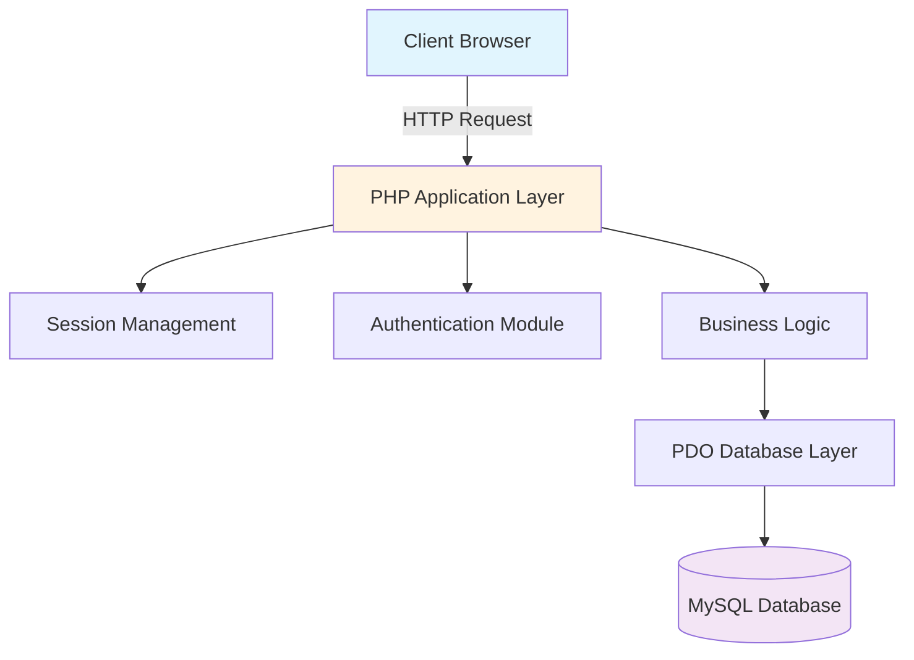
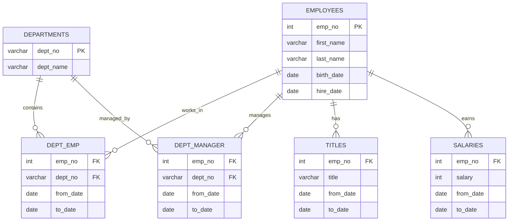

# 🏢 Employee-Manager-Systems

<div align="center">


<h3>A comprehensive HR management system for tracking employees, departments, salaries, and organizational hierarchy</h3>

**[Features](#✨-features) • [Installation](#🚀-installation) • [Usage](#💻-usage) • [Database](#🗄️-database-schema) • [Team](#👥-team-members)**

</div>

---

## 📖 Overview

The **Employee-Manager-Systems** is a robust PHP-based web application designed to streamline HR operations. It provides comprehensive tools for managing employee records, tracking departmental changes, monitoring salary progression, and maintaining organizational hierarchy through a clean, intuitive interface.

### 🎯 Key Objectives
- **Centralized employee data management**
- **Historical tracking of positions and salaries**
- **Role-based access control** (Employee vs Manager views)
- **Real-time department and title management**
- **Comprehensive audit trail for all changes**

## 👥 Team Members

| Name | Role | Responsibilities |
|------|------|-----------------|
| **James** | Full Stack Developer | Core features, backend logic, UI structure, and database integration |
| **Alex** | Full Stack Developer | Frontend/backend integration, system workflow development |
| **Yorfi** | Full Stack Developer | Database and backend fixes, creating and updating pages, and making core features work |
| **Alka** | Testing & Documentation | Quality assurance, documentation, testing protocols |

## ✨ Features

### 👤 Employee Features
- 🔐 **Secure Login System** - Employee number-based authentication
- 📊 **Personal Dashboard** - View personal information, current position, and salary
- 👀 **Profile Management** - Access to personal employment history
- 📈 **Career Tracking** - View title and department progression over time

### 👔 Manager Features
- **👥 Employee Management**
  - ➕ Add new employees
  - 📝 Edit employee information
  - 🗑️ Remove employees from system
  - 📋 View all employees

- **🏢 Department Operations**
  - 🔄 Transfer employees between departments
  - 📊 View department summaries
  - 👥 Department rosters and analytics

- **💰 Compensation Management**
  - 💵 Update employee salaries
  - 📈 Track salary history
  - 📊 Compensation reports

- **🏷️ Title Management**
  - 🎯 Assign new job titles
  - 📜 View title summaries
  - 🔍 Role-based filtering

- **👨‍💼 Manager Tools**
  - 📋 View managers list
  - 👤 Manager profiles
  - ℹ️ Manager information dashboard

## 🏗️ System Architecture



## 📁 Project Structure

```
Employee-Manager-Systems/
│
├── 📂 api/                      # API endpoints
│   ├── example.php             # Example API implementation
│   └── test.html               # API testing interface
│
├── 📂 database/                 # Database related files
│   ├── db_connect.php          # Database connection configuration
│   ├── schema.sql              # Database structure
│   └── seed.sql                # Sample data for testing
│
├── 📂 employee_dashboard_db/    # Database backups
│   └── see.sql.gz              # Compressed database backup
│
├── 📂 js/                       # JavaScript files
│   └── action.js               # Frontend interactions and AJAX
│
├── 📂 layout/                   # Common layout components
│   ├── header.php              # Page header template
│   └── footer.php              # Page footer template
│
├── 📂 views/                    # Application views/pages
│   ├── index.php               # Landing page
│   ├── login.php               # Login page
│   ├── logout.php              # Logout handler
│   │
│   ├── 📁 Employee Views
│   │   └── employee_dashboard.php  # Employee main dashboard
│   │
│   ├── 📁 Manager Views
│   │   ├── manager_dashboard.php   # Manager main dashboard
│   │   ├── manager_profile.php     # Manager profile page
│   │   ├── manager_info.php        # Manager information
│   │   └── managers_list.php       # List of all managers
│   │
│   ├── 📁 Employee Management
│   │   ├── add_employee.php        # Add new employee
│   │   ├── view_employees.php      # View all employees
│   │   └── delete_employee.php     # Delete employee
│   │
│   ├── 📁 Department Management
│   │   ├── change_department.php   # Change employee department
│   │   └── department_summary.php  # Department statistics
│   │
│   ├── 📁 Compensation & Titles
│   │   ├── update_salary.php       # Update employee salary
│   │   ├── change_title.php        # Change employee title
│   │   └── title_summary.php       # Title distribution summary
│
├── 📄 Root Files
│   ├── .gitignore              # Git ignore rules
│   ├── LICENSE                 # MIT License
│   ├── README.md               # Project documentation
│   ├── SETUP.md                # Setup instructions
│   ├── config.php              # Application configuration
│   ├── index.php               # Application entry point
│   ├── employee_dashboard.php  # Main dashboard router
│   ├── init_db.sh              # Database initialization script
│   └── employee_dashboard_db.zip # Database backup archive
```

## 🚀 Installation

### Prerequisites

- **XAMPP** (Includes PHP, MySQL, Apache)
- **phpMyAdmin** (Included with XAMPP)
- **Git** for version control
- **VS Code** or any code editor

### Step-by-Step Installation

1. **Clone the Repository**
   ```bash
   git clone https://github.com/Brago475/Employee-Manager-Systems.git
   cd Employee-Manager-Systems
   ```

2. **Start XAMPP Services**
   - Open XAMPP Control Panel
   - Start Apache
   - Start MySQL

3. **Configure Database Connection**
   
   Edit `database/db_connect.php` with your credentials:
   ```php
   <?php
   $host = 'localhost';
   $dbname = 'employee_dashboard_db';
   $username = 'root';  // Default XAMPP username
   $password = '';      // Default XAMPP password (empty)
   ```

4. **Import Database**
   
   **Option A: Using phpMyAdmin**
   - Open http://localhost/phpmyadmin
   - Create new database: `employee_dashboard_db`
   - Import `database/schema.sql`
   - Import `database/seed.sql` for sample data

   **Option B: Using Command Line**
   ```bash
   mysql -u root -p < database/schema.sql
   mysql -u root -p employee_dashboard_db < database/seed.sql
   ```

   **Option C: Using Provided Script**
   ```bash
   chmod +x init_db.sh
   ./init_db.sh
   ```

5. **Configure Application**
   
   Edit `config.php` if needed:
   ```php
   <?php
   define('BASE_URL', 'http://localhost/Employee-Manager-Systems/');
   define('DB_NAME', 'employee_dashboard_db');
   ```

6. **Access the Application**
   
   Navigate to: http://localhost/Employee-Manager-Systems/

   **Sample Login Credentials:**
   - **Manager:** Employee ID: 10001
   - **Employee:** Employee ID: 10003

## 🗄️ Database Schema

### Entity Relationship Diagram



## 📡 API Documentation

### Authentication

#### Login
```http
POST /views/login.php
```
**Request:**
```javascript
{
  "emp_no": 10001
}
```

#### Logout
```http
GET /views/logout.php
```

### Employee Operations

#### View Employee Dashboard
```http
GET /views/employee_dashboard.php
```

#### Add Employee (Manager Only)
```http
POST /views/add_employee.php
```
**Request:**
```javascript
{
  "first_name": "John",
  "last_name": "Doe",
  "birth_date": "1990-01-01",
  "hire_date": "2024-01-01",
  "dept_no": "d001",
  "title": "Engineer",
  "salary": 60000
}
```

#### Update Salary (Manager Only)
```http
POST /views/update_salary.php
```
**Request:**
```javascript
{
  "emp_no": 10001,
  "new_salary": 75000
}
```

#### Change Department (Manager Only)
```http
POST /views/change_department.php
```
**Request:**
```javascript
{
  "emp_no": 10001,
  "new_dept_no": "d002"
}
```

## 💻 Usage

### For Employees
1. **Login**: Navigate to `/views/login.php` with your employee number
2. **Dashboard**: View your employment information at `/views/employee_dashboard.php`
3. **Profile**: Access your complete employment history
4. **Logout**: End your session via `/views/logout.php`

### For Managers
1. **Login**: Use your employee number (must be registered as manager)
2. **Manager Dashboard**: Access `/views/manager_dashboard.php`
3. **Employee Management**:
   - Add employees: `/views/add_employee.php`
   - View all: `/views/view_employees.php`
   - Delete: `/views/delete_employee.php`
4. **Department Management**:
   - Transfer employees: `/views/change_department.php`
   - View summaries: `/views/department_summary.php`
5. **Compensation**:
   - Update salaries: `/views/update_salary.php`
   - Change titles: `/views/change_title.php`
   - Title summary: `/views/title_summary.php`
6. **Manager Tools**:
   - Manager list: `/views/managers_list.php`
   - Manager profiles: `/views/manager_profile.php`

## 🛠️ Tools & Technologies

### Development Tools
-  Code Editor
-  Local Server Environment
-  Database Management
-  Version Control

### Tech Stack
-  Backend Logic
-  Database
-  Frontend Interactions
-  Structure
-  Styling

## 🔒 Security Features

- ✅ **PDO Prepared Statements** - SQL injection prevention
- ✅ **Session Management** - Secure session handling
- ✅ **Input Validation** - Server-side validation
- ✅ **Access Control** - Role-based permissions
- ✅ **XSS Protection** - Output escaping
- ✅ **Database Backups** - Regular backup system

## 🐛 Troubleshooting

### Common Issues

1. **Database Connection Failed**
   - Verify XAMPP MySQL is running
   - Check credentials in `database/db_connect.php`
   - Ensure database `employee_dashboard_db` exists

2. **404 Not Found**
   - Check if project is in XAMPP's `htdocs` folder
   - Verify URL path matches folder name

3. **Session Errors**
   - Clear browser cookies
   - Check PHP session settings in `php.ini`

4. **Permission Denied**
   - Set proper file permissions (755 for folders, 644 for files)
   - Check Apache user has read access


## 📄 License

This project is licensed under the MIT License - see the [LICENSE](LICENSE) file for details.

---

<div align="center">


© 2025 Employee Management System - Built by Team [James, Alex, Yorfi, Alka]

</div>
